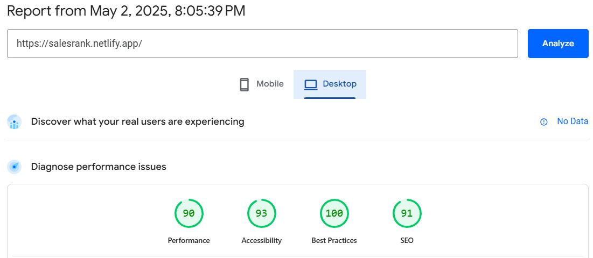
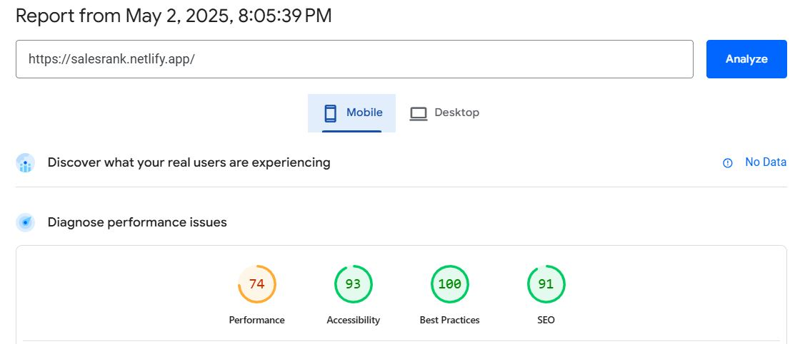
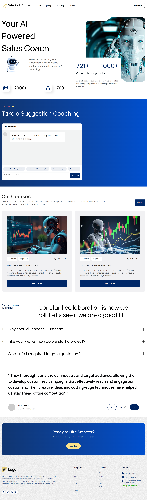

# SalesRank.ai - A website Landing page Development Task by Softvence.

## They provided Figma design and ask for below requirements

1. Implement the website according to the provided Figma design.
2. Follow best practices and clean architecture.
3. Make sure the UI is responsive on different screen sizes
4. Implement error handling if needed.

## Table of contents

- [Task Summary](#task-summary)
- [Site Analytics Report](#site-analytics-report)
- [Live Links](#links)
- [Built with](#built-with)
- [Run Locally](#run-locally)
- [Author](#author)
- [Screenshot](#screenshots)

## Task summary:

This was an awesome experience for me. This task helped me to strengthen my React and Tailwind CSS Skills

## Site Analytics Report

#### Site Analytics in Desktop view: [Verify URL](https://pagespeed.web.dev/analysis/https-salesrank-netlify-app/kzia1p328a?form_factor=desktop)

#### site Analytics in Mobile view: [Verify URL](https://pagespeed.web.dev/analysis/https-salesrank-netlify-app/kzia1p328a?form_factor=mobile)

### Links

- Project Live URL: [Live URL](https://salesrank.netlify.app/)
- My Portfolio URL: [Portfolio URL](https://merajsharif.netlify.app/#project)

### Built with

- React - v19.0.0
- React Router - v7.5.3
- Tailwind CSS - v4.1.4
- Vite - v6.3.1

## Run Locally

- clone this directory.
  `git clone https://github.com/Meraj-Sharif-Khan/salesrank.git`

- Install dependencies.
  `npm install`

- Run by.
  `npm run dev`

## Screenshots

### Desktop View

### Mobile View

.png>)

## Author

- LinkedIn - [@MerajSharif](https://www.linkedin.com/in/meraj-sharif-0413a6264/)
